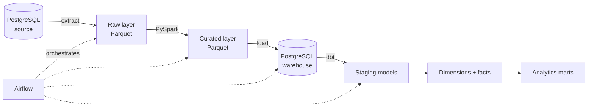

# Modern Retail Data Lakehouse Pipeline

**A batch data platform that takes six retail source domains from an operational Postgres database to tested, analytics-ready marts, orchestrated with Airflow and reproducible from a single command.**

`Python` · `PySpark` · `dbt` · `Apache Airflow` · `PostgreSQL` · `Parquet` · `Docker` · `GitHub Actions`

---

## What this is

A complete ELT platform built end to end rather than a single notebook or script. Raw operational data is extracted from PostgreSQL, landed as Parquet, transformed through curated lake layers with PySpark, loaded into a PostgreSQL warehouse, and modeled into dimensions, facts and marts with dbt. Airflow orchestrates the whole run. Everything is containerized, and `make` rebuilds the entire stack from nothing.

The point of the project is the parts that usually get skipped: data quality enforcement, layer separation, orchestration, and reproducibility. Any pipeline can move rows once. This one runs the same way every time and fails loudly when the data is wrong.

## Architecture



**Raw.** Source data landed as Parquet with no transformation applied. Partitioned, immutable, and always replayable. Anything downstream can be rebuilt from here without touching the source system again.

**Curated.** PySpark handles cleaning, typing, deduplication and conforming across the six source domains. Parquet again, partitioned for read efficiency.

**Warehouse.** Curated data loaded into PostgreSQL, where dbt takes over.

**Models.** dbt builds staging models on top of the loaded tables, then customer, product and date dimensions, an order fact table, and daily sales marts on top of those.

## Data model

A star schema, built in dbt with each layer materialized separately so lineage is traceable end to end.

| Model | Type | Grain |
|---|---|---|
| `dim_customer` | Dimension | One row per customer |
| `dim_product` | Dimension | One row per product |
| `dim_date` | Dimension | One row per calendar day |
| `fct_orders` | Fact | One row per order line |
| `mart_daily_sales` | Mart | One row per day |

## Data quality

**37 dbt tests** run across the models on every build: uniqueness and not-null on every primary key, referential integrity between facts and dimensions, accepted values on categorical columns, and freshness checks on sources.

**Python unit tests** cover the extraction and transformation logic independently of the warehouse.

**Both run in GitHub Actions CI** on every push. A build that breaks a data contract fails the pipeline rather than quietly publishing bad numbers into the marts.

This is the part of the project I'd point at first. Tests are what separate a pipeline you can put in front of an analyst from one you have to babysit.

## Running it

Requires Docker and Docker Compose. Everything else runs in containers.

```bash
git clone https://github.com/Abdulrahman-Zaghloul/retail-lakehouse-pipeline.git
cd retail-lakehouse-pipeline

make up          # start Postgres, Airflow and supporting services
make seed        # load source data into the operational database
make run         # execute the full pipeline end to end
make test        # run dbt tests and Python unit tests
make down        # tear everything down
```

Airflow UI at `http://localhost:8080`.

The Makefile exists so that a reviewer can get from clone to a fully populated warehouse without reading setup instructions. If any of these commands don't work on a clean machine, that's a bug.

## Project structure

```
├── airflow/          # DAG definitions and orchestration config
├── extract/          # Source extraction to the raw Parquet layer
├── spark/            # PySpark transformation jobs, raw to curated
├── dbt/
│   ├── models/
│   │   ├── staging/  # Source-conformed staging models
│   │   ├── marts/    # Dimensions, facts and analytics marts
│   │   └── schema.yml
│   └── tests/
├── tests/            # Python unit tests
├── docker-compose.yml
└── Makefile
```

## Design decisions

**Parquet lake layers rather than loading straight to the warehouse.** Keeping an immutable raw layer means every downstream table can be rebuilt without re-reading the source system. It also makes the transformation logic testable against fixed inputs.

**PySpark for curation, dbt for modeling.** Spark handles the messy work across heterogeneous source domains. dbt handles the warehouse modeling, where SQL is the right language and lineage, documentation and testing come built in. Using one tool for both jobs would mean doing one of them badly.

**Airflow rather than a shell script.** Task-level retries, dependency ordering and visible failure states matter more than the orchestrator being lightweight.

**Everything containerized and Makefile-driven.** A data project that only runs on the author's machine isn't finished.

## Limitations

- Batch only. No streaming ingestion or CDC.
- Runs locally against a containerized Postgres warehouse rather than a cloud platform such as Snowflake, BigQuery or Redshift. The layer separation and dbt models port over largely unchanged; the extraction and load steps would need rewriting.
- Source data is generated rather than production data, so volumes don't stress the Spark jobs the way real data would.
- No orchestration-level alerting or SLA monitoring configured.

---

**Abdulrahman (Abdul) Zaghloul**
[abdulrahmanxzaghloul@gmail.com](mailto:abdulrahmanxzaghloul@gmail.com) · [LinkedIn](https://linkedin.com/in/Abdul-Zaghloul) · [GitHub](https://github.com/Abdulrahman-Zaghloul)
