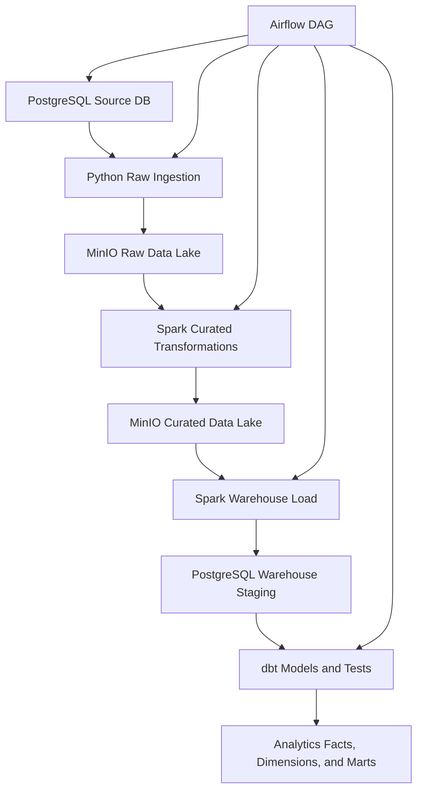
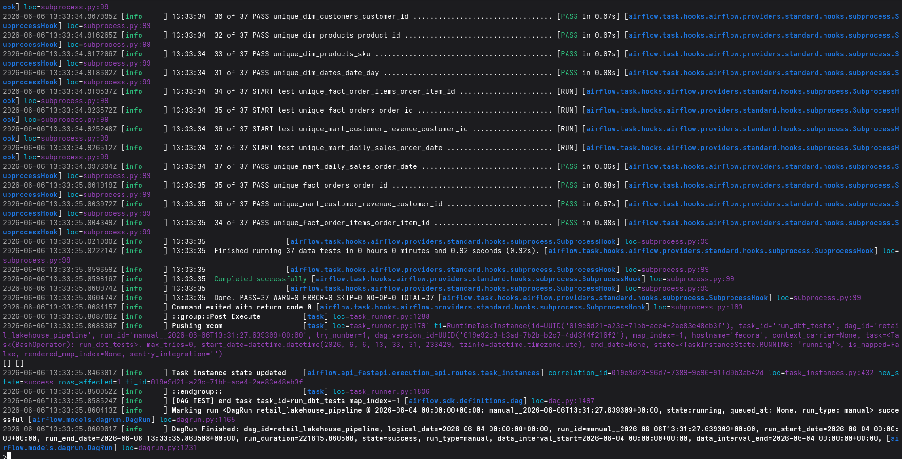
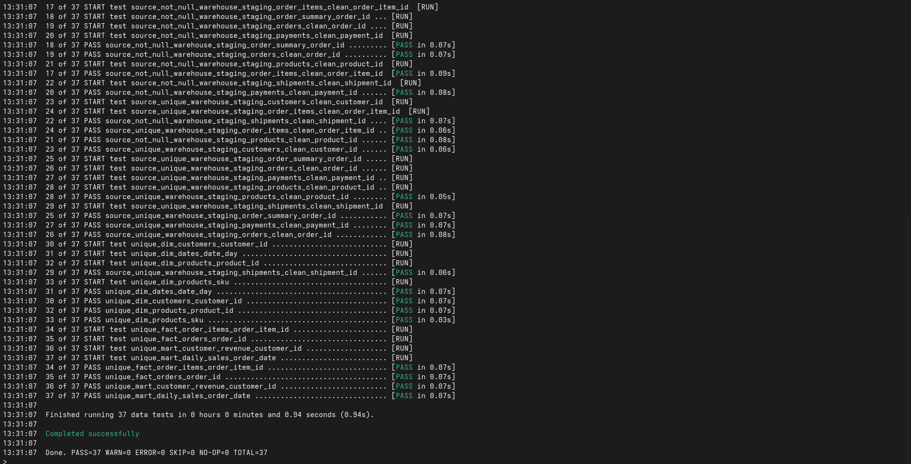
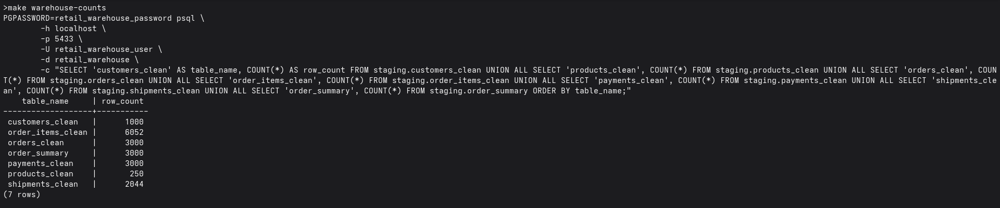
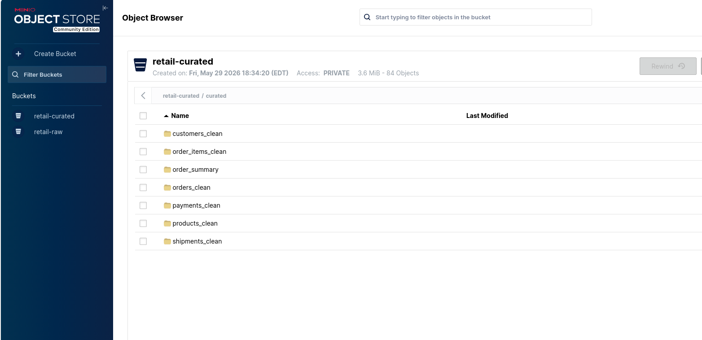
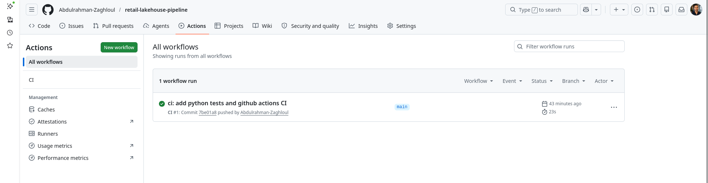

# Retail Lakehouse Data Engineering Pipeline

A production-style data engineering portfolio project that builds an end-to-end batch analytics pipeline for retail data.

This project demonstrates how to design, build, orchestrate, test, and document a modern data pipeline using:

* Python
* PostgreSQL
* MinIO
* Apache Spark
* dbt
* Apache Airflow
* Docker
* GitHub Actions

---

# Why This Project Exists

The goal of this project is to simulate a real company analytics pipeline locally.

A retail business typically operates systems that manage:

* Customers
* Products
* Orders
* Payments
* Shipments

Data engineers are responsible for extracting operational data, storing it reliably, transforming it, loading it into a warehouse, and making it available for analytics.

This project implements that complete lifecycle.

---

# Architecture


## Screenshots

### Airflow DAG Success



### dbt Tests Passing



### Warehouse Row Counts



### Curated Data Lake Files



### GitHub Actions CI



## End-to-End Data Flow

```text
PostgreSQL Source Database
        ↓
Python Ingestion Job
        ↓
MinIO Raw Parquet Data Lake
        ↓
Spark Curated Transformations
        ↓
MinIO Curated Parquet Data Lake
        ↓
Spark Warehouse Load
        ↓
PostgreSQL Warehouse Staging
        ↓
dbt Dimensional Models and Tests
        ↓
Analytics-Ready Facts, Dimensions, and Marts
        ↓
Airflow Orchestration
```

---

# Tech Stack

| Layer                | Technology                      |
| -------------------- | ------------------------------- |
| Source Database      | PostgreSQL                      |
| Data Generation      | Python, Faker                   |
| Raw Ingestion        | Python, psycopg, PyArrow, boto3 |
| Object Storage       | MinIO                           |
| Data Lake Format     | Parquet                         |
| Transformations      | Apache Spark                    |
| Warehouse            | PostgreSQL                      |
| Analytics Modeling   | dbt                             |
| Orchestration        | Apache Airflow                  |
| Local Infrastructure | Docker Compose                  |
| Testing              | pytest, dbt tests               |
| CI/CD                | GitHub Actions                  |

---

# What This Project Demonstrates

This project demonstrates practical data engineering skills including:

* Designing a layered data architecture
* Building source-to-lake ingestion pipelines
* Writing Parquet datasets
* Using S3-style object storage locally
* Transforming data with Spark
* Loading curated data into a warehouse
* Modeling facts, dimensions, and marts with dbt
* Implementing dbt data quality tests
* Orchestrating pipelines with Airflow
* Writing Python unit tests
* Implementing CI/CD with GitHub Actions
* Producing professional project documentation

---

# Data Model

## Source Database

The source database simulates a retail application containing:

* customers
* products
* orders
* order_items
* payments
* shipments

## Analytics Warehouse

### Dimensions

* dim_customers
* dim_products
* dim_dates

### Facts

* fact_orders
* fact_order_items

### Marts

* mart_daily_sales
* mart_customer_revenue

---

# Repository Structure

```text
.
├── airflow/                 # Airflow DAGs and runtime files
├── dashboards/              # Dashboard exports and screenshots
├── data/                    # Local development data placeholders
├── dbt/                     # dbt analytics project
├── docker/                  # Docker and database schema files
├── docs/                    # Project documentation
├── spark/                   # Spark jobs
├── src/                     # Python source code
├── tests/                   # Python unit tests
├── .github/workflows/       # GitHub Actions CI
├── docker-compose.yml
├── Makefile
└── requirements.txt
```

---

# Quick Start

## 1. Clone the Repository

```bash
git clone git@github.com:Abdulrahman-Zaghloul/retail-lakehouse-pipeline.git
cd retail-lakehouse-pipeline
```

## 2. Create a Virtual Environment

```bash
python3 -m venv venv
source venv/bin/activate
```

## 3. Install Dependencies

```bash
make install
```

## 4. Start Local Services

```bash
make up
```

## 5. Apply Source Schema

```bash
make schema-source
```

## 6. Run the Full Pipeline

```bash
make pipeline-local
```

This executes:

```text
Start Services
      ↓
Generate Source Data
      ↓
Ingest Raw Data
      ↓
Build Curated Spark Datasets
      ↓
Load Warehouse Staging Tables
      ↓
Run dbt Models and Tests
```

---

# Running with Airflow

Test the Airflow DAG:

```bash
make airflow-test
```

**DAG Name**

```text
retail_lakehouse_pipeline
```

Pipeline flow:

```text
start_local_services
        ↓
generate_source_data
        ↓
ingest_raw_to_minio
        ↓
build_curated_layer_with_spark
        ↓
load_curated_data_to_warehouse
        ↓
run_dbt_models
        ↓
run_dbt_tests
```

---

# Useful Commands

```bash
make help
```

Common commands:

```bash
make up
make ps
make source-counts
make ingest-raw
make list-raw
make spark-curated
make list-curated
make load-warehouse
make warehouse-counts
make dbt-build
make airflow-test
make test
```

---

# Data Quality

The project includes multiple layers of data validation.

## Source Database

* Primary keys
* Foreign keys
* Not-null constraints
* Accepted value checks
* Positive amount validations

## Spark Curated Layer

* Standardized fields
* Deduplicated primary keys
* Calculated order item totals
* Invalid line total flagging

## dbt Tests

* Uniqueness tests
* Not-null tests
* Relationship tests

Expected result:

```text
PASS=37
WARN=0
ERROR=0
```

## Python Unit Tests

Run:

```bash
make test
```

Expected result:

```text
4 passed
```

---

# CI/CD

GitHub Actions runs automatically on:

* Pushes to main
* Pull requests

The workflow validates:

* Dependency installation
* Python syntax compilation
* Unit tests with pytest

Workflow file:

```text
.github/workflows/ci.yml
```

---

# Documentation

| Document             | Purpose                             |
| -------------------- | ----------------------------------- |
| docs/ARCHITECTURE.md | Architecture overview               |
| docs/DATA_FLOW.md    | Pipeline flow                       |
| docs/DATA_QUALITY.md | Data quality controls               |
| docs/RUNBOOK.md      | Operations and troubleshooting      |
| docs/DECISIONS.md    | Engineering decisions and tradeoffs |

---

# Current Status

**Milestone 11:** Portfolio-ready README, architecture diagrams, testing, CI/CD, and project documentation.

---

# Future Improvements

Planned enhancements:

* Dashboard visualizations
* AWS deployment (S3, Redshift)
* Terraform infrastructure
* Great Expectations or Soda data quality checks
* Pipeline monitoring metrics
* Incremental ingestion
* Partition pruning optimization
* AWS cost and architecture documentation

---

# Portfolio Summary

This project demonstrates an end-to-end data engineering pipeline featuring:

* Source extraction
* Data lake storage
* Spark transformations
* Warehouse loading
* dbt analytics modeling
* Automated testing
* CI/CD
* Airflow orchestration

The goal is not only to build a functioning pipeline, but to demonstrate software engineering practices, documentation, testing, reproducibility, and maintainability expected in professional data engineering environments.
