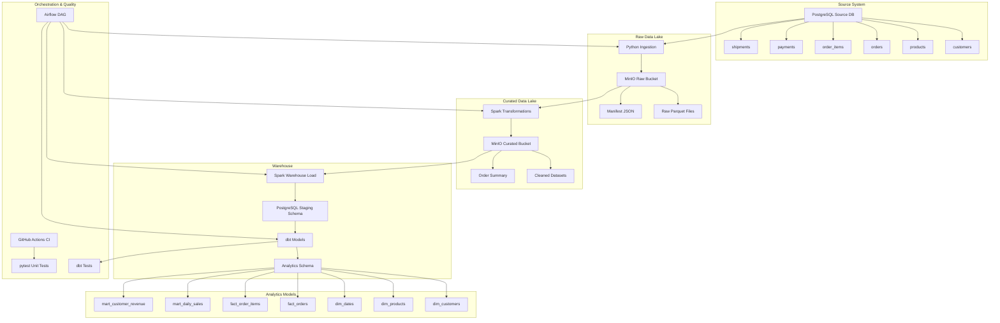

# Architecture Diagram

```mermaid
flowchart TD
    subgraph Source["Source System"]
        A[PostgreSQL Source DB]
        A1[customers]
        A2[products]
        A3[orders]
        A4[order_items]
        A5[payments]
        A6[shipments]

        A --> A1
        A --> A2
        A --> A3
        A --> A4
        A --> A5
        A --> A6
    end

    subgraph Raw["Raw Data Lake"]
        B[Python Ingestion]
        C[MinIO Raw Bucket]
        C1[Raw Parquet Files]
        C2[Manifest JSON]
    end

    subgraph Curated["Curated Data Lake"]
        D[Spark Transformations]
        E[MinIO Curated Bucket]
        E1[Cleaned Datasets]
        E2[Order Summary]
    end

    subgraph Warehouse["Warehouse"]
        F[Spark Warehouse Load]
        G[PostgreSQL Staging Schema]
        H[dbt Models]
        I[Analytics Schema]
    end

    subgraph Analytics["Analytics Models"]
        I1[dim_customers]
        I2[dim_products]
        I3[dim_dates]
        I4[fact_orders]
        I5[fact_order_items]
        I6[mart_daily_sales]
        I7[mart_customer_revenue]
    end

    subgraph Orchestration["Orchestration & Quality"]
        J[Airflow DAG]
        K[dbt Tests]
        L[GitHub Actions CI]
        M[pytest Unit Tests]
    end

    A --> B
    B --> C
    C --> C1
    C --> C2

    C --> D
    D --> E
    E --> E1
    E --> E2

    E --> F
    F --> G
    G --> H
    H --> I

    I --> I1
    I --> I2
    I --> I3
    I --> I4
    I --> I5
    I --> I6
    I --> I7

    J --> B
    J --> D
    J --> F
    J --> H

    H --> K
    L --> M
```
